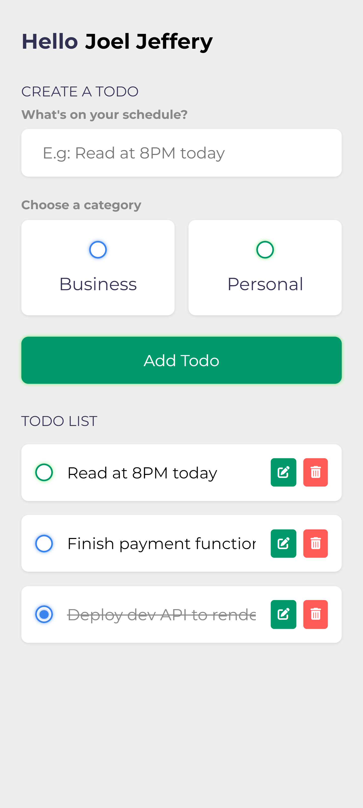

## JS Based Todo App

This is the complete source code for the todo app project, kindly clone the project to get started.

- HTML.
- CSS.
- JS

## About Us

[Techcoach](https://techcoach.pro) is a web development coaching platform, we aimed at raising world class Tech legends across the globe.

### Contact
To learn more about us, contact us using the following handle:

- **[Techcoach.pro](https://techcoach.pro/) - Website**
- **[Instagram.com](https://instagram.com/techcoach.pro) - Instagram**
- **[jeffery@techcoach.pro](mailto:jeffery@techcoach.pro) - Email**

Subscribe to our [Youtube](https://www.youtube.com/channel/UCs6rn-keO-4tZ0hWMXGzPvw) channel to get more updates on new projects we will be working on.